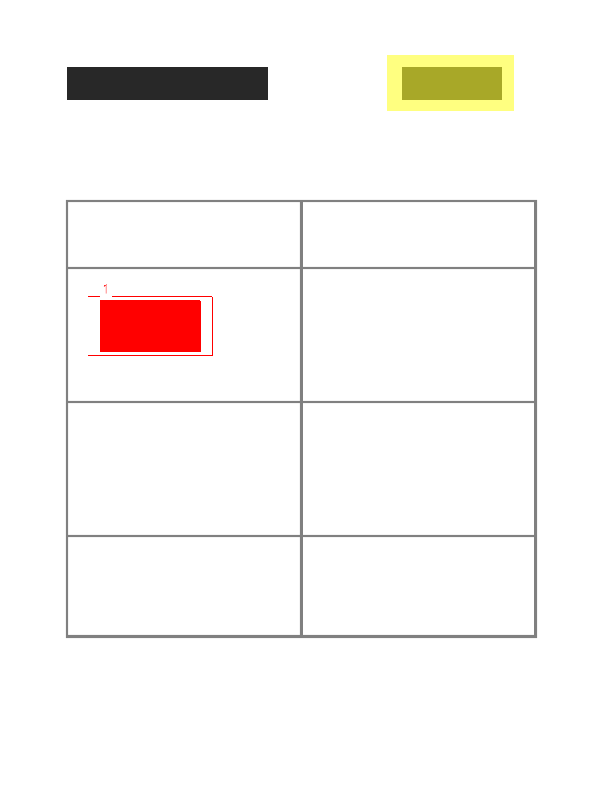

# T1-11 PDF 結合テストの確認

確認日：2026-09-21、macOS / Apple Silicon、.NET SDK 10.0.401、Chrome 153.0.8010.52。

**T1-11 完了。** `dotnet build` は警告 0・エラー 0、`dotnet test` は既存 417 件と追加 6 件の計 423 件が成功（失敗・スキップ 0）。CLI の実プロセスから PDF 読み込み・比較・除外・全出力までを検証した。製品コード、比較アルゴリズム、既定値、依存パッケージの変更はない。

## 合成 PDF と設定

`PdfFixture.CreateComparisonReport` が SkiaSharp で新旧それぞれ 2 ページの PDF を生成する。ページは 216 × 288pt（76.2 × 101.6mm）。表の罫線と矩形だけを描き、フォントに依存しない。1 ページ目は同一、2 ページ目には次の 2 つの変更がある。

| 領域 | 位置と大きさ（mm） | 新旧の違い |
|---|---|---|
| 本文の変更 | X 12.7、Y 38.1、幅 12.7、高さ 6.35 | 青い矩形から赤い矩形へ変更 |
| 出力日時相当の変更 | X 50.8、Y 約 8.47、幅 12.7、高さ 約 4.23 | 明るい灰色から暗い灰色へ変更 |

次の YAML だけを指定し、DPI や比較パラメータを上書きせず、既定の 300dpi・通常設定で比較する。

```yaml
exclude:
  - {page: 2, x: 49, y: 7, w: 16, h: 7, note: 出力日時}
```

PDF はテスト実行時に一時ディレクトリに生成し、終了時に削除する。入力・設定・出力先には日本語と空白を含む。実帳票や PDF バイナリをテスト資産として保存する必要はない。

## 自動テスト

`PdfCliIntegrationTests` の 6 件はすべて、共通の `CliProcess.Run` から `dotnet reportdiff.dll compare ...` を起動する。終了コードと厳密な UTF-8 の標準出力・標準エラーを読み取る。既存 CLI テストも同じ起動処理を使う。

| 条件 | 件数 | 終了コード | 結果 |
|---|---:|---:|---|
| 新旧の比較、2 ページ目の出力日時を除外（A/B 双方向） | 2 | 1 | 1 ページ目は `same`、2 ページ目に 1 クラスタ |
| 同一 PDF 同士（旧同士・新同士） | 2 | 0 | 両ページとも `same`、クラスタ 0 |
| 除外設定なし | 1 | 1 | 2 ページ目の変更を 2 クラスタとして検出 |
| 同じ除外矩形を 1 ページ目にだけ指定 | 1 | 1 | 2 ページ目の変更を 2 クラスタとして検出 |

除外しない対照テストによって、出力日時の変更も検出可能であり、ページ指定を含めた除外処理が適用されていることを確認する。

相違 1 箇所のケースでは、JSON を逆シリアライズして入力パス・形式・ページ数・SHA-256、要約、ページ状態、変更位置・寸法、実効設定と除外情報を検証する。出力は次の 8 ファイルだけで、相違のない 1 ページ目の画像は保存されない。

```text
result.json
report.html
pages/p002_a.png
pages/p002_b.png
pages/p002_overlay.png
crops/p002_c001_a.png
crops/p002_c001_b.png
crops/p002_c001_diff.png
```

PNG はすべてデコードでき、BGR 8bit である。ページ PNG の寸法は JSON と一致し、切り出しの A/B/差分は同サイズで余白を持つ。変更中心の赤、除外領域の黄色、A/B の画素差も検証する。HTML 内の JSON は `result.json` と意味的に一致し、画像の相対参照と除外の注記を含み、外部 URL を含まない。同一 PDF の比較では JSON・HTML の 2 ファイルだけを生成する。

ページの理論寸法は 900 × 1200px、今回の描画結果は 899 × 1200px。寸法テストは T1-6 の PDF 入力と同じ ±1px の許容を使う。クラスタ数・終了コード・同一判定は完全一致で検証する。

## 生成結果の表示

同じ合成 PDF を CLI で比較し、終了コード 1、相違ページ 1、クラスタ 1、差分画素数 11,625 を確認した。変更の外接矩形は X 12.62、Y 37.93、幅 12.78、高さ 6.52mm。次の重ね描きでは本文だけが赤い差分となり、出力日時は黄色の除外表示になる。



生成した HTML は既存の `tools/verify-html-report.mjs` で Chrome の `file://` から検証した。幅 1280px / 390px で全画像の読み込み、A/B/重ね描きの切り替え、キーボード操作、設定の開閉、埋め込み JSON の一致を確認。ページ全体の横はみ出し、ページエラー、CSP 違反、外部リクエストは 0 件だった。両幅の画面も画像で確認した。

## 再実行と残る範囲

リポジトリのルートで実行する。

```bash
dotnet build
dotnet test
dotnet test -- --filter-class ReportDiff.Tests.PdfCliIntegrationTests
```

Windows の追加テスト・実機動作・Edge / Chrome 表示は未確認。フォントを含む実帳票の評価や Windows 向け単一 exe の配布確認を、この合成 PDF の結果で代替しない。Intel Mac は対象外。T1-12 には未着手。
