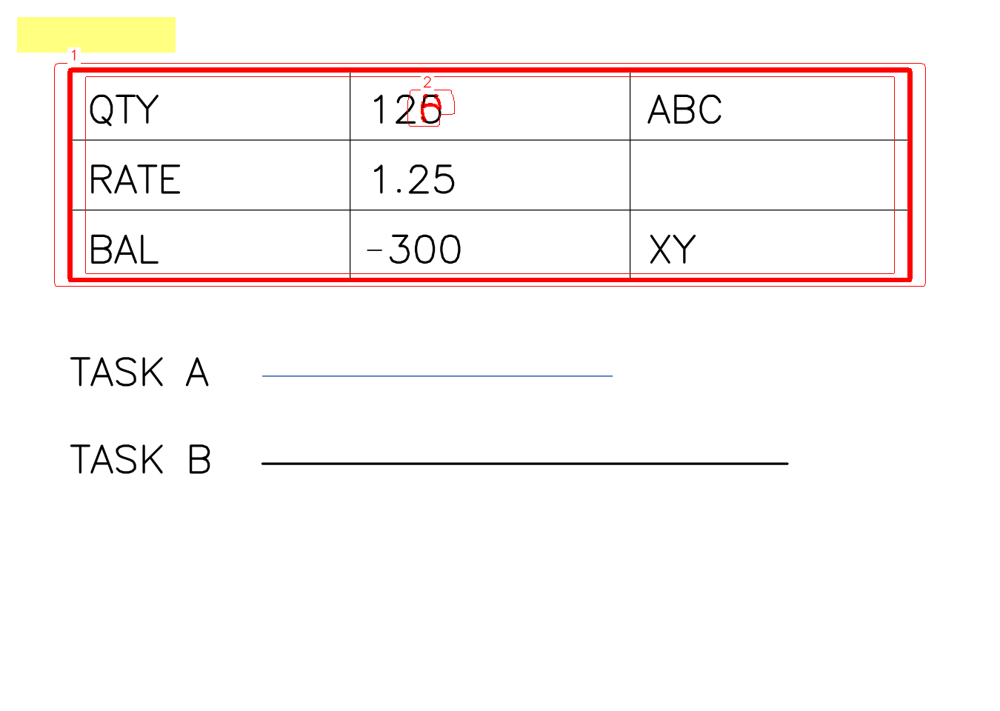
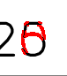

# T1-8 JSON と画像出力の確認

確認日：2026-09-21、macOS / Apple Silicon、.NET SDK 10.0.401。

**T1-8 完了。** `dotnet build` は警告 0・エラー 0、`dotnet test` は既存 325 件と出力 15 件の計 340 件が成功（失敗・スキップ 0）。

## API と出力契約

- `ReportInput.FromFile(path, format, pages)` は .NET のストリームで SHA-256 を求め、入力パス・形式・ページ数とともに保持する。形式とページ数は入力読み込み側の確認結果を渡す。
- `AppSettings.ToReportConfiguration()` で、既定値・プロファイル・上書き適用後の実効設定を出力層へ渡す。依存の向きは Cli → Report → Pdf → Core のまま。
- `ReportWriter(outputDirectory, inputs, config, saveAllPages)` は空の出力先を使う。既存ファイルの上書きは行わない。CLI の `--force` による出力先の準備は T1-10 で接続する。
- `AddComparedPage(page, normalizedImages, comparison, dpi)` は借用した Mat と比較結果から、そのページの画像を保存して JSON 用データを作る。画像を変更・所有せず、書き出し後に呼び出し側で破棄できる。全ページ分の Mat は保持しない。
- `AddUnpairedPage(page, image)` は、元の入力ページ数から `only_in_a` / `only_in_b` を決め、存在する側の画像だけを保存する。
- `Complete()` が `ReportDocument` を返し、`result.json` を UTF-8 で出力する。ページは元のページ番号で昇順にする。書き込みに失敗した writer は続行できず、日本語の `ReportWriteException` を返す。失敗時の途中ファイルは残るため、再実行は空の出力先で行う。

JSON は SPEC 8.2 の項目と snake_case 名を使う。設定の除外対象は `"page": "all"` または整数、Phase 2 用の `kind`・`shift_px`・`text_a`・`text_b` は null。`ReportJson.Options` で同じ型に逆シリアライズできる。

`summary.pages_compared` は両側を比較したページ数、`pages_different` は `same` 以外の出力ページ数（片側だけのページも含む）。元のページ数が異なる場合は、共通ページのみの選択でも `summary.status = different` とする。白埋め後が `same` のサイズ差は、`size_mismatch` と警告に残す。

吸収数・最大ずれ・ノイズ除去数は比較結果からコピーする。除外領域と注記は実効設定に保持する。`PAGE_COUNT_MISMATCH`、`MIXED_INPUT_TYPES`、`SIZE_MISMATCH`、`TOO_DIFFERENT`、`CLUSTER_LIMIT` は日本語メッセージ付きで出力する。

## 画像

- 既定では `same` ページの画像を保存せず、JSON の `images` の各値は null にする。`saveAllPages = true` なら A・B・重ね描きの 3 枚を保存する。
- 出力画像の参照は `pages/p001_a.png`、`crops/p001_c001_diff.png` のように `/` 区切りの相対パスとする。ファイル保存には `Path.Combine` を使う。
- 重ね描きは B を基に、生の差分を赤、採用クラスタの輪郭を赤線、クラスタ番号を白地に赤文字で描く。輪郭は `RETR_LIST` とし、枠の内側も描画する。
- 当該ページに適用される除外領域の和を、半透明の黄色（50%）で描く。mm からの換算は `Units` を使い、左上切り捨て・右下切り上げでページ内にクリップする。
- 切り出しはクラスタ矩形に `crop_margin_mm` を加え、外向きに丸めてページ内にクリップする。A・B・diff のサイズは同じ。diff は B の切り出しの生差分だけを赤にする。JSON の bbox は余白を含まない。
- PNG は `ImEncode` → .NET のファイル書き込みで保存する。日本語・空白のパスをネイティブへ渡さない。

[OpenCV の輪郭取得](https://docs.opencv.org/4.13.0/d3/dc0/group__imgproc__shape.html)と [System.Text.Json のプロパティ命名](https://learn.microsoft.com/en-us/dotnet/standard/serialization/system-text-json/customize-properties)を確認した。比較アルゴリズム、ゴールデン期待値、依存パッケージは変更していない。

## テストと目視確認

| 確認項目 | 件数 |
|---|---:|
| JSON の項目名・逆シリアライズ・実効設定・mm 換算・相対パス・切り出し画素 | 1 |
| 同一ページの保存有無、吸収・ノイズ・サイズ差の記録 | 2 |
| A/B だけのページの画像、要約、並び順、形式混在警告 | 2 |
| 共通ページだけを選択したページ数不一致 | 1 |
| 差分率・クラスタ数上限の出力 | 2 |
| 入れ子の輪郭、番号、除外領域の色とページ指定 | 1 |
| 左上・右下の切り出し余白のクリップ | 2 |
| 入力ファイルの既知の SHA-256 | 1 |
| 既存ファイル・重複ページ・完了後の再出力の拒否 | 1 |
| 画像の書き込み失敗後に成功結果を出さない | 1 |
| D11 の実際の比較結果から外枠と内側の数値を別々に出力 | 1 |
| 合計 | 15 |

合成ゴールデン D11 を使い、外枠と数値変更が 2 クラスタ、切り出しが 6 枚になることを確認した。目視用には内容に重ならない除外領域（x=2, y=2, w=18, h=4mm）を加え、次の PNG を生成して確認した。

## 残る範囲

HTML は [T1-9 確認結果](t1-9-html.md) を参照。T1-10 の CLI 接続は未着手。`--save-all-pages` 相当の API は実装済みだが、比較コマンド自体はまだ実行できない。Windows での追加テスト、日本語の出力パス、実際のディスク容量不足の確認は未実施。

再実行はリポジトリのルートで `dotnet build` と `dotnet test`。macOS の初回準備は [ネイティブ依存の準備](../NATIVE_RUNTIME.md) を参照。
