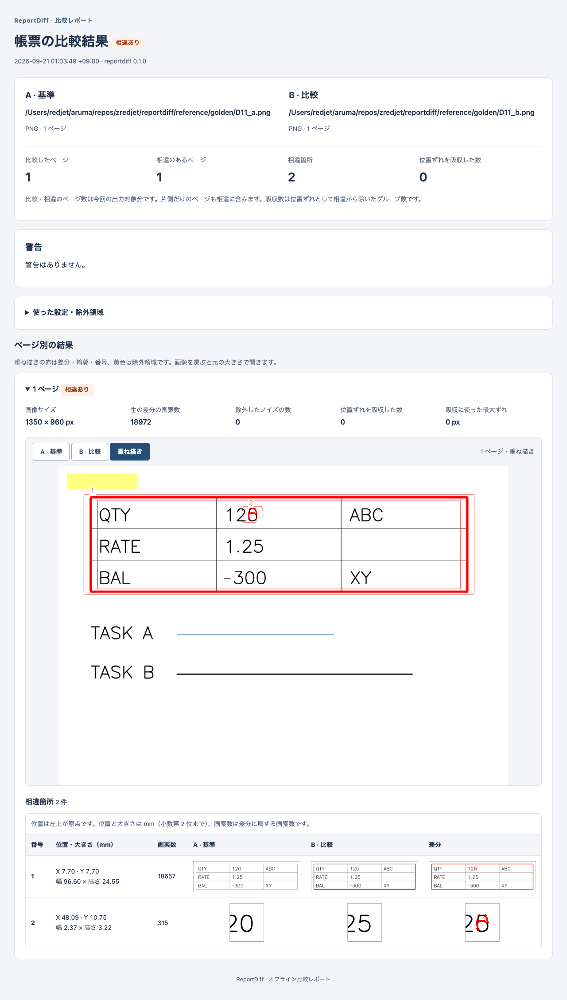

# T1-9 HTML レポートの確認

確認日：2026-09-21、macOS / Apple Silicon、.NET SDK 10.0.401、Chrome 153.0.8010.52。

**T1-9 完了。** `dotnet build` は警告 0・エラー 0、`dotnet test` は既存 340 件と HTML 19 件の計 359 件が成功（失敗・スキップ 0）。Chrome の `file://` で操作・表示を確認した。Windows の Edge / Chrome は未確認。

## API と表示内容

`ReportWriter.Complete()` の結果を `HtmlReportWriter.Write(outputDirectory, report)` に渡すと、同じ出力先に UTF-8（BOM なし）の `report.html` を追加する。`HtmlReportWriter.Render(report)` は HTML 文字列を返す。既存の HTML は上書きせず、ファイルの書き込みに失敗した場合は日本語の `ReportWriteException` を返す。JSON・PNG の内容は変更しない。

```csharp
var report = writer.Complete();
HtmlReportWriter.Write(outputDirectory, report);
```

- 要約には A/B の入力パス・形式・元のページ数、全体の判定、比較ページ数、相違ページ数、相違箇所数、位置ずれの吸収数を表示する。
- 警告には日本語メッセージとコードを表示する。実効設定と全除外領域（ページ指定・mm 座標・メモ）は折りたたみで確認できる。
- ページごとにサイズ、生の差分画素数、除外したノイズ数（小さな連結成分の数）、吸収数、吸収に使った最大ずれ、サイズ差の白埋めを表示する。
- 相違のあるページは初期表示で展開し、A / B / 重ね描きを切り替えられる。初期値は重ね描き。片側だけの場合は存在する側を表示し、存在しない画像のボタンを無効にする。
- 相違なしのページは折りたたみ、開くと吸収等の記録を確認できる。画像が保存されていれば切り替えでき、未保存なら説明を表示する。差分が多すぎる場合はクラスタ化を省略した理由を表示する。
- 相違箇所は番号、左上の X/Y と幅・高さ（mm、小数第 2 位まで）、画素数、A/B/差分の切り出しを 1 行に並べる。ページ画像と切り出しは選択すると元の大きさで開く。狭い画面では一覧内だけを横スクロールする。
- `result.json` と同じ内容を `<script type="application/json" id="result">` に埋め込む。文字のエスケープ表現は異なるが、JSON として読んだ値は一致する。

CSS と素の JavaScript はアセンブリの埋め込みリソースから HTML 内へ展開する。外部 CSS・JavaScript・フォント・ネットワーク参照はない。画像は既存の `pages/` と `crops/` の PNG 相対パスだけを許可する。入力パス・注記・警告を HTML エスケープし、JSON は既定の安全なエンコーダを使用する。本文・JSON のスラッシュも符号化することで、注記に URL が含まれても HTML 内に `http://` / `https://` のリテラルを残さず、表示内容と JSON 値は保持する。

データブロックは [MDN の script type](https://developer.mozilla.org/en-US/docs/Web/HTML/Reference/Elements/script/type)、切り替え状態は [MDN の aria-pressed](https://developer.mozilla.org/en-US/docs/Web/Accessibility/ARIA/Reference/Attributes/aria-pressed) を確認した。ボタンの選択状態・画像の代替テキスト・キャプションを同期する。JavaScript が無効でも要約・設定・初期画像・一覧を読める。

## 検証

| 自動テスト | 件数 |
|---|---:|
| 外部 URL 不在、要約・警告・実効設定・吸収等・3 切り出し・埋め込み JSON | 1 |
| 特殊文字や閉じ script タグを含む入力でも表示値と JSON を保持 | 1 |
| 外部・絶対・親参照・属性注入等の画像パスを拒否（ページ画像と切り出しの両方） | 10 |
| 相違なし・画像未保存でも統計を保持 | 1 |
| A のみ / B のみの画像と無効ボタン | 2 |
| 差分過多の説明 | 1 |
| カルチャに依存しない mm・設定値の小数表記 | 1 |
| JSON・PNG 出力からの接続、日本語・空白パス、UTF-8、既存ファイル保護 | 1 |
| 書き込み失敗・不正な画像参照で HTML を作らない | 1 |
| 合計 | 19 |

ブラウザ検証は Playwright 1.62.1 とインストール済み Chrome を用い、独立した headless ブラウザからローカルファイルを開いた。合成ゴールデン D11 の実際の JSON・画像出力に加え、表示状態専用の DTO で相違なし（保存有無）、差分過多、A のみ、B のみ、サイズ差、吸収・ノイズ、注記へのタグ混入を確認した。状態専用 DTO の数値は比較アルゴリズムの検証結果としては扱わない。

| ブラウザ確認項目 | 結果 |
|---|---|
| 日本語・空白を含む保存先を `file://` で開く | 成功 |
| 全画像の遅延読み込み・デコード | 成功、欠損なし |
| A / B / 重ね描き、元画像リンク・選択状態・代替テキスト・キャプションの同期 | 成功 |
| 複数ページで独立した切り替え | 成功 |
| Tab / Enter / Space、フォーカス表示、一覧の矢印キー横スクロール | 成功 |
| 設定の開閉、入力パス・警告・吸収数・JSON の一致 | 成功 |
| 幅 1280px / 390px、本文・ボタン・統計の収まり | 成功、ページ全体の横はみ出しなし |
| script 文字列の実行、ページエラー、CSP 違反、外部リクエスト | いずれも 0 件 |
| JavaScript 無効時の本文表示・切り替えボタン非表示 | 成功 |

幅 1280px と 390px の画面を画像でも確認した。次は D11 の表示例。



## 再実行

リポジトリのルートで `dotnet build` と `dotnet test`。HTML だけのテストは次で実行できる。

```bash
dotnet test -- --filter-class ReportDiff.Tests.HtmlReportTests
```

生成済みレポートのブラウザ検証には `tools/verify-html-report.mjs` を使う。Node.js、Playwright、Chrome を開発環境に用意する。Playwright は任意の検証用ツールで、アプリ・NuGet 依存・配布物には追加していない。

```bash
# Playwright が標準の探索先にない場合、その node_modules を指定する。
export NODE_PATH=/path/to/node_modules
node tools/verify-html-report.mjs /path/to/output/report.html out/html-browser-check
```

出力先の `result.json` と埋め込み JSON を比較し、幅別のスクリーンショットを保存する。別のブラウザを試す場合は `REPORTDIFF_BROWSER` に実行ファイルの絶対パスを指定する。

## 残る範囲

T1-10 の CLI 接続（`--no-html` を含む）は未着手。Windows の追加テスト、Windows の Edge / Chrome の実機表示、スクリーンリーダー、実際のディスク容量不足は未確認。Intel Mac は対象外。
