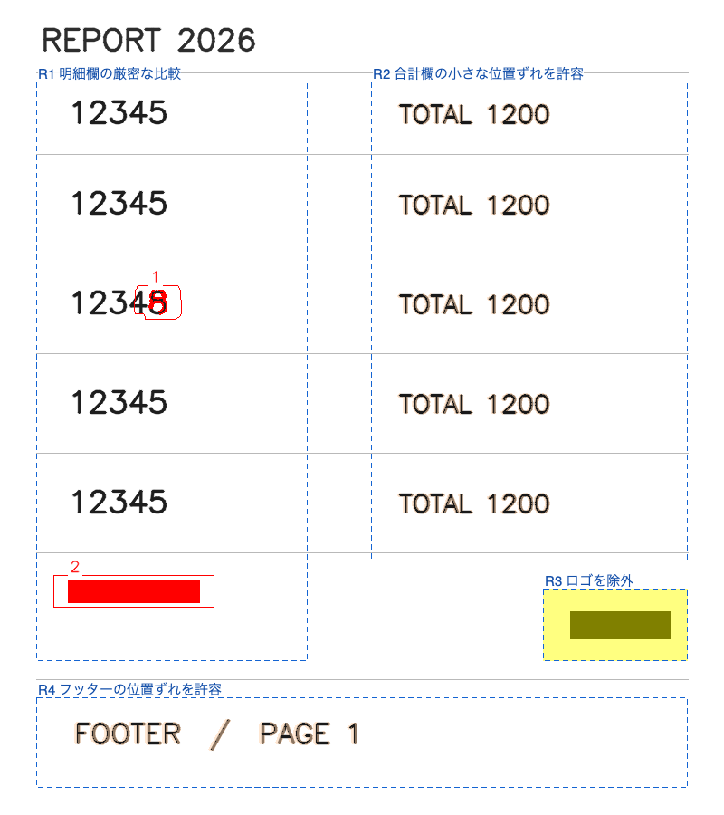

# T3-4b 領域別設定

確認日：2026-09-22。macOS Apple Silicon、.NET SDK 10.0.401 / Runtime 10.0.12、Chrome 153.0.8010.52。[承認済み仕様](../planning/t3-4b-regions.md)に沿って実装した。T3-4b 完了。Windows 実機は未確認。T2-8 の保留候補は維持する。

## 実装した動作

`regions` で profile / diff の部分上書きと mode: exclude を指定できる。ページ既定値 → 領域 profile → 領域 diff の順で合成し、親領域の設定は継承しない。完全内包は内側、除外は常に優先する。同一矩形・部分交差・最終 DPI の丸めによる共有画素を、キー名付きで拒否する。ページ外はクリップし、無効範囲の理由を報告する。

異なる実効 diff ごとに全ページの生差分を逐次計算し、画素の所有領域から合成して一度だけクラスタ化する。分類は画素ごとの edge_tolerance を反映する。移動の対応画素は移動元・移動先の両方の diff を満たす必要があり、一方向だけ緩い条件で一致する場合は元の分類と差分を残す。

`--no-regions` は regions と既存 exclude を比較・全体補正・PDF 注釈・判定画像から外し、無視した宣言を監査情報として残す。compare-dir は配列全体の置換・空配列による解除・省略による継承に対応する。ページの profile と align の有効／無効は維持する。

JSON / HTML に実効設定・適用状態・所有画素・生差分・抑制／除外量・全ページ実行への参照を記録する。抑制箇所は生差分の 8 近傍連結成分数で、通常クラスタの相違件数とは別。基準のノイズ閾値未満も含み、除外と重複加算しない。既存の吸収数・最大ずれはページ既定値による基準実行を保つ。

判定画像は青破線と日本語名で領域を示し、薄い橙色で抑制した画素を示す。すべての相違を抑制した場合も保存する。HTML はページを閉じた状態でも抑制画素数を表示する。元 A/B と T3-6 の赤青画像は変更しない。

## 自動検証

Debug / Release ビルド：警告 0・エラー 0。42 ゴールデンを含む全 1,306 テスト成功、失敗・スキップ 0（332.302 秒）。通常の `dotnet test` が使うローカル IPC の制約を避け、同じ xUnit v3 のテスト DLL を直接実行した。

専用テストは 78 件。主な内容は次のとおり。

- 8 ゴールデン × normal / strict / loose、正逆両方向で全面単一領域とページ指定を比較。生差分・クラスタ・番号・矩形・種類・移動量・関連 ID・削除マスクが一致する。
- 領域内だけ 1px 移動を検出、領域をまたぐ追加／削除／色変更を一つのクラスタとして分類。分類の元インク／膨張インクを画素ごとに選び、削除色まで一致する。
- 異なる色しきい値をまたぐ移動は元／先・正逆両方向で検証する。黒同士は moved、黒→RGB(32,32,32) は厳密側で差が残るため changed。ともに 336 生差分画素・1 クラスタを維持する。関連 ID・部分説明・競合も確認する。
- 内包・除外優先・同一矩形・部分交差・mm/px の丸め・72/254/300/600dpi・ページ外・設定の重複実行回避。未知／必須／範囲違反は領域番号とキーを含むエラー。
- ノイズ閾値未満の生差分、斜めに連結する抑制画素、除外の重なりを使い、抑制画素・8 連結箇所・除外量の別集計を確認する。
- 実 CLI の JSON 往復・日本語名と HTML エスケープ・全差分抑制後のページ保存・監査・compare-dir・HTML 省略・PDF 全体補正とテキスト注釈・片側／対象外ページ・不正設定時の旧出力保持。
- 相違なしの領域表示でも PNG 保存失敗で Complete を拒否し、`--force` の旧結果を保持して一時領域を後始末する。

## 変更前との互換性

`bbf14cf` を別ビルドし、42 ゴールデンを保存済み params・--save-all-pages・--raw-overlay で実行した出力と照合した。最終 Release CLI でも、全ケースの終了コード、generated_at 以外の JSON 全項目、261 PNG（従来 219＋確認用 42）の SHA-256 が一致した。領域なしでは新しいメタデータも省略される。[機械可読記録](t3-4b-compatibility.json)、[照合スクリプト](../../tools/verify-region-compatibility.py)を参照。

実 CLI の領域有効／監査／領域なしで、確認用 PNG の全バイトと元カラー A/B の全画素が一致した。全体補正を領域除外で見送り、監査で採用した PDF でも、確認用 PNG は同一だった。比較式・参照実装・既存ゴールデンの期待は変更していない。

## ブラウザと画像

[合成帳票の作成](../../tools/prepare-region-review.py)と[領域検証](../../tools/verify-regions.mjs)で、通常／監査 × 1280/390px × JavaScript 有効／無効の 8 条件を検証した。設定と集計値の一致、日本語名の全文、適用状態、基準／別設定の実行情報、details のキーボード操作、狭い幅での表の横スクロールとフォーカス表示を確認した。ページ全体の横はみ出し、JavaScript エラー、外部リクエストは 0。[ブラウザ記録](t3-4b-browser.json)。

既存の [HTML 検証](../../tools/verify-html-report.mjs)と[確認用画像の検証](../../tools/verify-raw-overlay.mjs)も成功。判定表示と赤青表示の独立した切り替え、元画像リンク、PNG 単体、除外 YAML の選択、操作前後の状態・件数不変を確認した。

合成帳票は通常の相違 2 件・4,041 生差分画素を維持し、領域設定による抑制は 9,119 画素・147 箇所、除外は 930 画素。PNG の日本語名・破線・抑制色・差分輪郭と番号を目視確認した。

## A4 の時間・最大 RSS

[測定スクリプト](../../tools/measure-regions.py)、[全測定値](t3-4b-performance.json)。2480×3508px・300dpi、600 字形の合成帳票。最初の 1 回はウォームアップ、続く 3 回の中央値。順番を交互に変え、独立 CLI プロセスの起動・PNG 読み込み・比較・PNG/JSON 保存を含める。HTML・PDF 描画・raw evidence は含めず、領域枠の描画は含む。計測中は全テストとビルドを止めている。

ページ既定は normal。2 設定は左側 100mm を strict、3 設定はさらに右側 100mm を loose とする。異なる設定は全ページでそれぞれ計算する。

| 入力 | 設定数 | 時間中央値 | 最大 RSS | 生差分／クラスタ |
|---|---:|---:|---:|---:|
| 1 字形を変更 | 1 | 547.0ms | 955.3MiB | 204／1 |
| 同上 | 2 | 659.5ms | 937.1MiB | 204／1 |
| 同上 | 3 | 750.2ms | 1062.1MiB | 204／1 |
| 字形変更＋全体を右下へ 1px | 1 | 568.7ms | 955.5MiB | 204／1 |
| 同上 | 2 | 1500.6ms | 961.0MiB | 95004／301 |
| 同上 | 3 | 1587.8ms | 1082.2MiB | 95004／301 |

2 設定では基準比で約 113〜932ms、3 設定では約 203〜1,019ms 増加した。strict にした領域では吸収していた位置ずれを検出するため、後半のケースはクラスタ数も増える。処理時間の差は追加実行だけの費用ではない。RSS は各プロセスの最大値で、GC 等のばらつきがある。2 設定の値が一部で基準より低いことは省メモリの保証を意味しない。特徴量・探索データは設定ごとに解放し、同じ設定を持つ領域は一回の実行を共有する。

## Windows 配布物

win-x64 自己完結・単一 exe の publish と静的検査、配布 ZIP の静的検証に成功。exe は 156,650,565 バイト、SHA-256 は `ae2b7f38bf39f157d91fe9e3a02839c676a123963655adce9c657001d50b6dc0`。自己完結ランタイムは .NET 10.0.12。既承認のネイティブ DLL ハッシュ、必要な管理／ネイティブライブラリ、FFmpeg 非同梱、許諾文、ZIP CRC と全ファイルのマニフェストを確認した。最終文書を含む配布 ZIP は `out/reportdiff-t3-4b-win-x64.zip`。Windows での実行を確認したという意味ではない。

Windows 実機での起動、日本語フォントの代替と領域名の PNG 描画、ブラウザ、DPI、管理者権限なしの実行は未確認。TASKS の Windows 確認リストに残す。次の T3-1a は本タスクに含めない。
